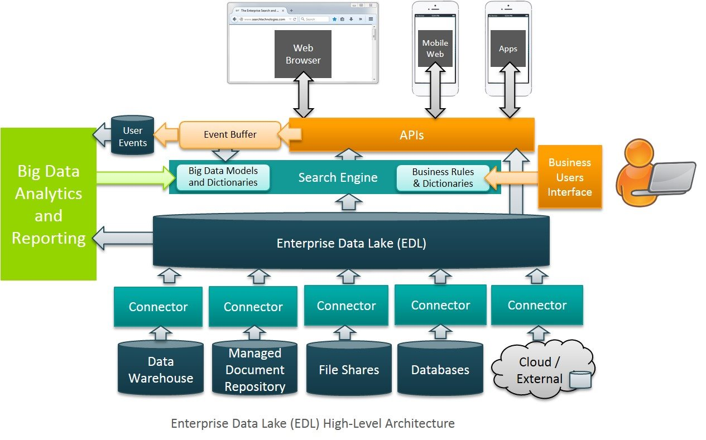
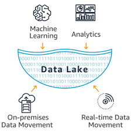

# Department of Better Communities
``` The Dept. of BC provides information services to a wide range of federal and state government departments. 
They are empowered through legislation to collect, analyse and share data relating to citizens and organisations throughout Australia. 
Their goal is to improve the lives of all Australians by arming government service providers with the information they need to best serve the community. 
Initial success has seen a steep increase in demand for Dept. of Better Communities services, and the largely scientific workforce is struggling to keep up 
while maintaining quality.
o The value uplift / cost take out opportunities
o Impacts on the organisation's strategy and competitive position in market o The technology architecture considerations
o Business architecture/process impacts
o Future state operating model
```

## Assumptions:
- Department of Better Communities has a operating data platform. 
- I'm taking Big Data Architect (Data Lake) role 
- I'm blending technical and business approach
- I will be using on-premise due to government's sencitivity towards data security. 

## Proposal: 

```Data Lake architecture ```




```Data And analytics platform with Machine learning and data science features.```




## Value output: 
- Output will change from data to decision / Insights 
- Increased business value 
- Using the data lake platform, Advance analytics can help to find the corulation between different parameters (for instance, how people reacted to the 
citizenship / RTA changes, and what impact it made to those departments etc).
- Highly enriched dataset for data partners, business users, and top officials

## Impacts on the organisation's strategy and technology
- Increased number of ending users / organisations 
- Highly scalable architecture 
- Integrated platform for data and analytics
- real data used for data analytics and model building
- Provide data dictionary and meta data management capabilities  
- Provide CI/CD capabilities 
- Platform that enables Applications running inside a container environment. 

## Business architecture/process impacts:
- Short and simple process for data analytics pipeline building.
- Enable Business users with self serviced data platform.
- Running batch jobs during off peak timing making sure that the resources are using effectively 
- Real time streaming of data.
- APIs for providing data and receiving data

## Future state operating model
- Single integrated platform for data, analytics, data science and business usage. 
- Code build and deployments period will reduce from months to days/weeks.
- Seamless integration of codes and data from different environment and formats
- Scalability
- Self-healing Docker environment
- Ability to handle data centre and apps 
- Fault tolerance
- High Availability
- Multiple Layers of Security
- Docker Container Driven   
- Quick and easy to create end to end data flow
- Easy Build and Host Applications
- Optimised load pattern
- Authorisation and Authentication at different levels
- Seamless integration of third-party dataset such as GNAF, ABS dataset, etc.
- Code deployment and environment setup made easy through Jenkins and Bitbucket 
- Freedom of choosing tools and functional programming languages .i.e Python, R, Scala, etc. 
- Easy integration of Open sourced graph databases like Grapana, Tidb, Neo4j,  etc., 
- Self-serviced framework
- Data Exploration and Analysis
